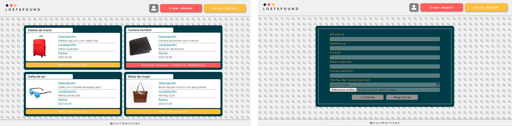

  

Introducción
-------------
Primera aplicación en la que hago uso del entorno de ejecución Node.js y la base de datos MongoDB. Esta app permite el registro de usuarios para que, una vez iniciada su sesión, puedan publicar objetos perdidos que se muestran públicamente. 

  

Descripción
-------------
* Acceso público al listado de objetos perdidos.
* Registro de usuarios con hash de contraseña y envío de correo electrónico de confirmación.
* Login de usuarios registrados y confirmados para poder publicar nuevos objetos perdidos.
* Publicación de nuevas fichas con posibilidad de subir archivos.
* Opción de modificar los datos de usuario y de eliminar el perfil de la base de datos.
* Cierre de sesión siempre que el usuario lo desee.

Características
-------------
* HTML5, CSS3, JS
* SASS
* [Node.js](https://nodejs.org/es/)
* [Express.js](https://expressjs.com/es/)
* [Express-handlebars](https://www.npmjs.com/package/express-handlebars)
* [Express-session](https://www.npmjs.com/package/express-session)
* [Mongoose](https://mongoosejs.com/)
* [MongoDB](https://www.mongodb.com/es)
* [Nodemailer](https://nodemailer.com/about/)
* [Bcrypt](https://www.npmjs.com/package/bcrypt)
