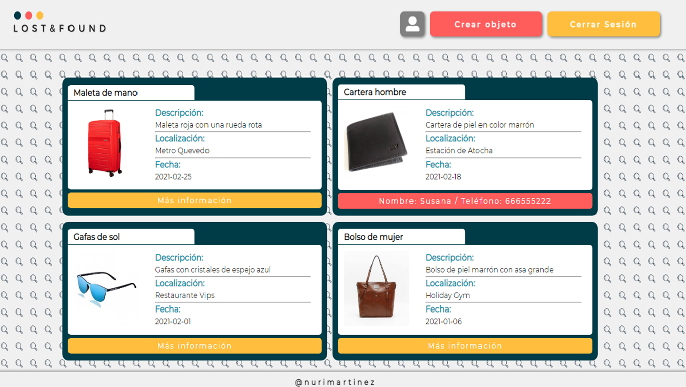

  

Introducción
-------------
Aplicación para la publicación de objetos perdidos. Tiene un formulario de registro de usuarios que envía emails de confirmación y acceso para usuarios ya registrados. El formulario para publicar nuevos objetos solo es accesible para clientes de la aplicación. 

  

Características
-------------
* HTML5, CSS3, JS
* SASS
* [Node.js](https://nodejs.org/es/)
* [Express.js](https://expressjs.com/es/)
* [Express-handlebars](https://www.npmjs.com/package/express-handlebars)
* [Express-session](https://www.npmjs.com/package/express-session)
* [Mongoose](https://mongoosejs.com/)
* [MongoDB](https://www.mongodb.com/es)
* [Nodemailer](https://nodemailer.com/about/)
* [Bcrypt](https://www.npmjs.com/package/bcrypt)
